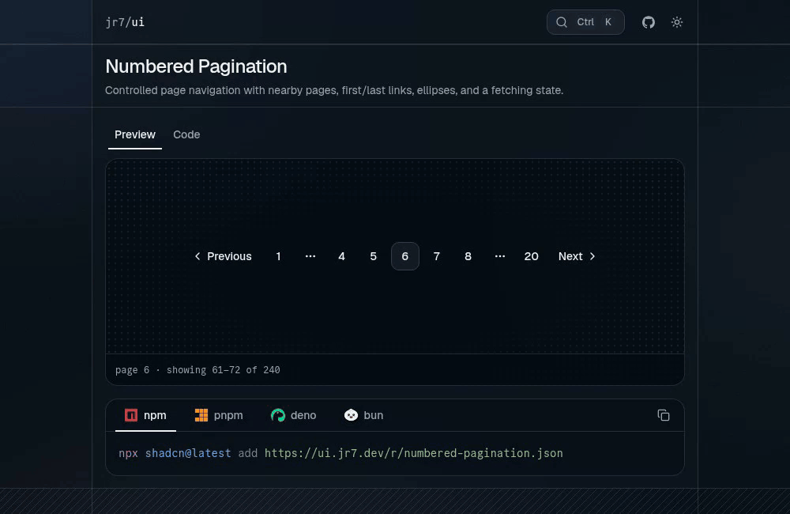

# jr7/ui

A shadcn registry of React components I struggled to find elsewhere.

[](https://ui.jr7.dev)

## Components

- [Loading button](#loading-button): shows a spinner and blocks repeat clicks during an async action.
- [Numbered pagination](#numbered-pagination): page navigation with nearby pages, first/last links, and ellipses.
- [Audio visualizer](#audio-visualizer): a mirrored waveform driven by a Web Audio analyser or frequency samples.
- [Error message](#error-message): an inline alert with a close button and optional auto-dismiss.

## Install

You need a React project already set up for shadcn. The CLI installs each component's npm and shadcn dependencies along with the source.

```bash
npx shadcn@latest add https://ui.jr7.dev/r/loading-button.json
```

Swap `loading-button` for `numbered-pagination`, `audio-visualizer`, or `error-message`.

Or add the namespace to `components.json` once:

```json
{
  "registries": {
    "@jr7": "https://ui.jr7.dev/r/{name}.json"
  }
}
```

```bash
npx shadcn@latest add @jr7/loading-button
```

The examples below import from `@/components`. Change the paths if your alias differs.

### Loading button

Wraps the shadcn `Button`. While `isLoading` is true it swaps the children for a spinner and `loadingText`. You own the loading state.

```tsx
"use client"

import { useState } from "react"
import { LoadingButton } from "@/components/loading-button"

export function SaveButton({ onSave }: { onSave: () => Promise<void> }) {
  const [isLoading, setIsLoading] = useState(false)

  async function handleSave() {
    setIsLoading(true)
    try {
      await onSave()
    } finally {
      setIsLoading(false)
    }
  }

  return (
    <LoadingButton type="button" isLoading={isLoading} loadingText="Saving…" onClick={handleSave}>
      Save changes
    </LoadingButton>
  )
}
```

- `isLoading` (`boolean`, required): shows the spinner, disables the button, and sets `aria-busy`.
- `children` (`ReactNode`, required): idle content.
- `loadingText` (`string`, default `"Sending..."`): label next to the spinner.
- `isDisabled` (`boolean`, default `false`): extra disabled flag, OR'd with `isLoading` and `disabled`.
- Other shadcn `Button` props work except `asChild`. `variant` defaults to `"secondary"` and `type` to `"submit"`, so pass `type="button"` outside forms.

The spinner stops rotating under reduced motion.

[Source](registry/jr7/loading-button/loading-button.tsx) · [Demo](components/demos/loading-button.tsx)

### Numbered pagination

Renders previous/next, up to two pages on each side of the current one, first/last buttons outside that window, and ellipses for gaps. It doesn't fetch anything. You update the page and load the results.

```tsx
"use client"

import { useState } from "react"
import { NumberedPagination } from "@/components/numbered-pagination"

export function ResultsPagination() {
  const [page, setPage] = useState(1)

  return (
    <NumberedPagination page={page} totalResults={240} resultsPerPage={12} onPageChange={setPage} />
  )
}
```

- `page` (`number`, required): current page, 1-based.
- `totalResults` (`number`, required): total result count.
- `resultsPerPage` (`number`, required): page size. Page count is `ceil(totalResults / resultsPerPage)`, minimum 1.
- `onPageChange` (`(page: number) => void`, required): called with the requested page.
- `isFetching` (`boolean`, default `false`): disables navigation and sets `aria-busy`.
- `hasNextPage` (`boolean`, optional): `false` disables Next early. `true` can't push past the last page and doesn't affect the numbered buttons.
- Standard `<nav>` props work. `aria-label` defaults to `"Pagination"`.

The displayed page is floored and clamped to the valid range. Bad totals or page sizes fall back to one page. None of this calls `onPageChange`, so keep your own state in sync when the total changes.

For a custom UI, `getPaginationRange(page, totalResults, resultsPerPage)` returns the normalized `page`, `totalPages`, neighboring pages, and the first/last/ellipsis flags.

[Source](registry/jr7/numbered-pagination/numbered-pagination.tsx) · [Demo](components/demos/numbered-pagination.tsx)

### Audio visualizer

Pass a Web Audio `AnalyserNode` and it draws a mirrored waveform with `audvis`. Pass byte-frequency samples instead and it renders an SVG, no audio context needed.

```tsx
import { AudioVisualizer } from "@/components/audio-visualizer"

export function AudioPreview() {
  return (
    <AudioVisualizer
      isActive
      frequencyData={[40, 90, 150, 220, 180, 120, 80, 30]}
      height={48}
      ariaLabel="Sample audio frequency spectrum"
    />
  )
}
```

For live audio, pass the analyser from your player:

```tsx
<AudioVisualizer
  analyser={analyser}
  isActive={isPlaying}
  progress={duration > 0 ? currentTime / duration : undefined}
  ariaLabel="Playback progress"
/>
```

- `isActive` (`boolean`, required): when false, shows a flat dashed idle strip.
- `analyser` (`AnalyserNode | null`, optional): wins over `frequencyData` if both are set.
- `frequencyData` (`readonly number[] | Uint8Array`, optional): samples from 0 to 255. Out-of-range values are clamped, non-finite ones become 0.
- `progress` (`number`, optional): 0 to 1. Switches the role from `img` to `progressbar` and exposes the percentage through ARIA. It doesn't draw a progress indicator.
- `width` (`number`, default `680`): internal drawing width, which sets the bar count. The waveform still fills its container.
- `height` (`number`, default `24`): height in pixels. Minimums are 8px wide and 4px high.
- `color` (`string`, optional): any CSS color. Defaults to `text-primary` and follows theme changes.
- `className` (`string`, optional)
- `ariaLabel` (`string`, default `"Audio waveform"`)

Under reduced motion or with no input, it shows the idle strip.

It never requests the microphone, plays audio, or opens or closes an audio context. That's on you. The [demo](components/demos/audio-visualizer.tsx) uses an [`openMicrophone` helper](lib/microphone.ts) that doesn't ship with the component.

[Source](registry/jr7/audio-visualizer/audio-visualizer.tsx) · [Demo](components/demos/audio-visualizer.tsx)

### Error message

An inline alert with an icon and close button. Clearing the message hides it.

```tsx
"use client"

import { useState } from "react"
import { ErrorMessage } from "@/components/error-message"

export function ErrorExample() {
  const [message, setMessage] = useState<string | null>(null)

  return (
    <div>
      <ErrorMessage message={message} setMessage={setMessage} autoDismissTimeout={0} />
      <button type="button" onClick={() => setMessage("We couldn't save your changes.")}>
        Show error
      </button>
    </div>
  )
}
```

- `message` (`string | null`, required): `null` or `""` hides the alert.
- `setMessage` (`(message: string | null) => void`, required): called with `null` on close or timeout. A state setter works directly.
- `autoDismissTimeout` (`number`, default `5000`): ms before auto-dismiss. `0` or less disables it.
- `className` (`string`, optional)

The timer starts when the message appears, even if it's off-screen. Changing the message, timeout, or setter restarts it.

It uses `role="alert"`, labels the close button, and skips animations under reduced motion.

[Source](registry/jr7/error-message/error-message.tsx) · [Demo](components/demos/error-message.tsx)

## Development

```bash
pnpm install
pnpm dev
```

Components live in [`registry/jr7`](registry/jr7) and their metadata in [`registry.json`](registry.json). Run `pnpm registry:build` after editing one to regenerate the JSON. `pnpm build` does that and builds the site.

## Credits

- [chanhdai.com](https://github.com/ncdai/chanhdai.com) (MIT): panel layout adapted from here. The page dividers and circular theme reveal were inspired by it.
- [VengeanceUI](https://github.com/Ashutoshx7/VengeanceUI) (MIT): the package manager picker.
- [shadcn/ui](https://ui.shadcn.com): base components and registry tooling.
- Commit Mono by Eigil Nikolajsen (SIL OFL 1.1): the monospace font. [License](app/fonts/CommitMono-LICENSE.txt).
